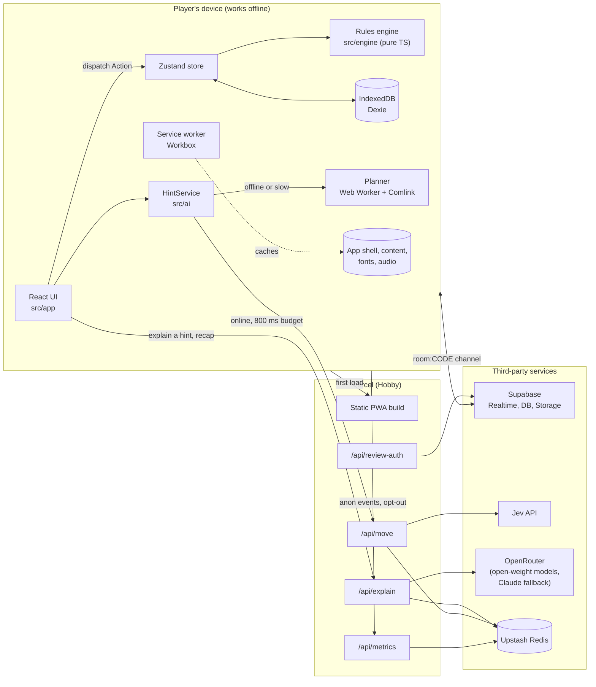

# Tianguis: architecture and dependencies

> **Status: planned.** As of 2026-10-07 the repository holds only planning documents (`README.md`, `north-star.md`, `roadmap.md`, `tasks.md`). Nothing below is built yet. Each section names the task in [tasks.md](../tasks.md) that will build it, so this file can be updated to "built" piece by piece.

## At a glance

| Layer | Choice | Runs where | Task |
|---|---|---|---|
| Language | **TypeScript** (`strict`) everywhere: client, engine, server functions, scripts | Browser, Web Worker, Node | TG-001 |
| Runtime | **Node 22** (pinned in `.nvmrc`) | Local dev, CI, Vercel functions | TG-001 |
| Package manager | **pnpm** | Local, CI | TG-001 |
| UI | **React** + **Vite** single-page app | Browser | TG-001 |
| App shell | **PWA** via `vite-plugin-pwa` (Workbox) | Browser service worker | TG-003 |
| Game rules | Pure TypeScript reducer, no dependencies | Browser, Web Worker, Node (sim, host) | TG-010 to TG-014 |
| Offline storage | **IndexedDB** via Dexie | Browser | TG-018, TG-045, TG-006 |
| Translations | **i18next** + ICU message format | Browser | TG-004 |
| Multiplayer | **Supabase Realtime** (Broadcast + Presence), free tier | Supabase cloud | TG-030 to TG-034 |
| Server | **Vercel functions** under `api/` | Vercel, Hobby plan | TG-002, TG-042, TG-044 |
| Hints and bots (online) | **Jev** `Choice` API, called from `/api/move` | Vercel function | TG-041, TG-042 |
| Hints and bots (offline) | Greedy planner in a Web Worker | Browser | TG-015 |
| Explanations | Open-weight models via **OpenRouter** as Axo, from `/api/explain`; Claude Haiku as the last fallback | Vercel function | TG-044 to TG-046 |
| Rate limits, metrics | **Upstash Redis** (Vercel Marketplace, free tier) | Upstash cloud | TG-042, TG-061 |
| Hosting, CI | **Vercel** previews + **GitHub Actions** | Vercel, GitHub | TG-002 |

## System diagram



## Source layout

```
src/engine/   pure game logic: types, rng, reducer, events (never imports React or the browser)
src/app/      React UI: screens, components, Zustand store
src/net/      Supabase room client (create, join, leave, onState, sendIntent)
src/ai/       DecisionProvider, HintService, greedy planner (Web Worker)
src/content/  goods.json, orders.json, events.json, notes.json, credits.json
src/i18n/     catalogs: {es,en,nah,yua,quz}/common.json
api/          Vercel functions: move, explain, metrics, review-auth
scripts/      i18n-check, pull-reviews, jev-smoke, sim
public/audio/ reviewed recordings: {lang}/{goodId}.webm
docs/         this file, balance.md, jev.md, a11y.md, demo.md
```

Path aliases: `@engine`, `@app`, `@net`, `@ai`, `@content` (TG-001).

## Key design decisions

### 1. The engine is a pure, seeded reducer
`apply(state, action) → state` is a pure function, and `legalActions(state, stallId)` enumerates every move. The RNG (mulberry32) keeps its state **inside** `GameState`, so any game replays exactly from its seed and action log. This one decision lets the same code run in four places: the UI store, the bot worker, the Node simulation harness (`pnpm sim`) and the multiplayer host. `src/engine/` may not import React, the DOM or any network code; lint enforces this.

### 2. Offline first, network optional
Everything needed for a solo or pass-and-play game is in the static build and precached by Workbox: app shell, `src/content/**`, self-hosted Noto fonts, and recorded audio (runtime `CacheFirst`). `/api/*` is `NetworkOnly`, and every feature that uses it has an offline fallback:

| Feature | Online | Offline fallback |
|---|---|---|
| Consejo hint | Jev via `/api/move` | Planner in a Web Worker |
| Bot seats | Jev, 600 ms budget | Planner |
| Axo explanation | OpenRouter via `/api/explain` | Cached explanation in IndexedDB, else the bundled cultural note |
| Recap story | OpenRouter, `mode=recap` | Template text |
| Telemetry | Flushed to `/api/metrics` | Queued in IndexedDB |
| Saved game | n/a | Dexie, keyed by `gameId`, versioned schema |

### 3. Multiplayer: the host is the source of truth
Rooms use a Supabase Realtime channel `room:{code}` (5-letter code, no O/0/I/1). There are **no database tables for play**.
- Clients send `intent{action, seatId, nonce}` over Broadcast.
- The host checks the intent against `legalActions` and the turn, applies it, and broadcasts `state{version, state}`. Clients render only the newest version.
- Bot seats run on the host.
- Presence tracks seats. If the host leaves, the seat with the earliest `joinedAt` takes over and rebroadcasts `version + 1` (TG-033).
- Nothing is hidden, since the game is co-operative, so state is never redacted.

### 4. AI is pluggable and always has a fallback
`DecisionProvider { name: 'jev' | 'planner'; pick(state, seat, legal) }` (TG-040). `HintService` tries Jev only when online and within 800 ms, and the UI labels which engine answered. Jev picks an **index into the legal-action list**, so it can never produce an illegal move.

### 5. No model writes Indigenous-language text
This holds for every model `/api/explain` can reach, open-weight or Claude. `/api/explain` speaks only Spanish or English. The system prompt includes the approved glossary as a cached block; the response is structured as `{text, termsUsed[]}`, and the server rejects any term not in the approved glossary and returns template text instead. A refusal or any error also returns template text (TG-044).

### 6. Content is data with a review status
Every Indigenous-language string carries `status: draft | reviewed | approved` and a `source`. The UI shows an "en revisión" badge for anything not approved, and `VITE_HIDE_UNREVIEWED=true` hides languages that aren't fully approved. Reviewer submissions go to Supabase; a script turns approved ones into a PR so a person always merges content (TG-020 to TG-023).

### 7. Secrets stay on the server
Only `VITE_*` variables reach the browser, and the only ones planned are the Supabase URL and anon key (public by design) and the build flag. Jev and OpenRouter keys live only in Vercel function env vars. `/api/move` validates input with zod, caps the body at 8 KB and rate-limits per room.

### 8. Explanations route to cheap open-weight models first
See [AI routing](#ai-routing) below. Jev stays the decision engine; only the text Axo says goes through OpenRouter.

## AI routing

Two different jobs, two different routes:

| Job | Route | Why |
|---|---|---|
| Hints and bot moves | **Jev** `Choice` API, direct from `/api/move` | Jev picks an index into `legalActions`, so it can never make an illegal move. It is not a text job. |
| Axo's words: hint explanations, goods stories, recap | **OpenRouter** from `/api/explain`: open-weight models first, Claude Haiku last | It is short Spanish or English text checked against a glossary, which open-weight models handle at a fraction of the price. |

### Models and fallback order

Prices checked on OpenRouter's catalog on 2026-10-07, per million tokens (input / output). Provider prices vary; the range is the cheapest to the typical provider that supports structured outputs.

| Order | Model (pinned slug) | Weights | Price | Role |
|---|---|---|---|---|
| 1 | `openai/gpt-oss-120b` | Open (Apache 2.0) | $0.03 to $0.15 / $0.17 to $0.60 | Default. Around 20 providers serve it, most with `response_format`, so provider outages rarely reach players. |
| 2 | `xiaomi/mimo-v2.6-flash` | Open | $0.10 to $0.14 / $0.28 | Second model family, so one model's bad day isn't ours. |
| 3 | `deepseek/deepseek-v4.1-flash` | Open | $0.05 to $0.15 / $0.18 to $1.20 | Third family. |
| 4 | `anthropic/claude-haiku-4.5` | Closed | $1 / $5 ($0.10 cached input) | Quality fallback, only after the open-weight answer fails validation. |

Rough cost per call (2,500 input tokens, mostly the glossary, and 200 output tokens), and per session at the cap of 10 calls:

| Model | Per call | Per session |
|---|---|---|
| `openai/gpt-oss-120b` (typical provider) | $0.0005 | $0.005 |
| `claude-haiku-4.5` (glossary cached) | $0.002 to $0.0035 | $0.02 to $0.035 |
| `claude-opus-5.5` (the earlier plan in TG-044) | $0.014 | $0.14 |

Models are pinned by slug and never by a `~…-latest` alias, because every model change re-runs the eval below. The list lives in `api/_lib/models.ts` and can be overridden with `EXPLAIN_MODELS` without a code change.

### How a request is routed

1. **Cache first.** Goods stories depend only on `(goodId, lang)` and explanations on `hash(actionKind, goodsInvolved, lang)` (the TG-045 key). `/api/explain` checks Upstash before calling any model, so most goods stories cost nothing after the first player sees them.
2. **Open-weight call.** One OpenRouter request with `models: [1, 2, 3]` so OpenRouter falls through models on its own, and:
   - `response_format` with the JSON schema `{text, termsUsed[]}`, plus `provider.require_parameters: true`, so only endpoints that honour the schema are used;
   - `provider.sort: "price"` and `provider.max_price` set to the ceiling in the table, so a pricey provider is never picked silently;
   - `provider.data_collection: "deny"`, so no provider that trains on prompts is used (the game sends no personal data, but players include kids);
   - `max_tokens: 300`, `temperature: 0.4`, and a 2.5 s timeout.
3. **Validate.** The server parses the JSON, rejects any `termsUsed` term not in the approved glossary, rejects any glossary-language word in `text` that isn't listed in `termsUsed`, and checks the reply is in the requested language (a stop-word ratio check, no extra service).
4. **Claude fallback.** If step 2 times out or step 3 fails, and the session still has budget, one more call goes to `anthropic/claude-haiku-4.5` through the same OpenRouter key, with the glossary block marked `cache_control`. Same validation.
5. **Template text.** If that also fails, or any cap below is hit, the planner's template text or the bundled note card is returned, exactly as offline. Players never see an error.

The UI does not label which model answered; it only labels Jev versus the planner (decision 4), because that changes what the hint is.

### Cost caps and rate limits

All counters live in Upstash (already planned for TG-042). Usage cost comes back on every OpenRouter response (`usage: {include: true}`), so caps track real money, not estimates.

| Limit | Default | Over the limit |
|---|---|---|
| Calls per game session (`gameId`) | 10 | Template text |
| Spend per game session | $0.01 | Template text; the Claude step is skipped first |
| Calls per minute per client (salted IP hash, kept 60 s) | 6 | HTTP 429, client shows template text |
| Spend per day, whole app (`EXPLAIN_DAILY_BUDGET_USD`) | $2 | Template text for everyone until midnight UTC |
| OpenRouter key credit limit, set in the OpenRouter dashboard | A little above the daily budget × 30 | Hard backstop if the Upstash counter is wrong |

At $0.005 a session, $2 a day covers about 400 online sessions.

### Evaluating Spanish and English before shipping

`pnpm eval:explain` (`scripts/eval-explain.ts`) runs a fixed set of cases through each model in the list and writes a report to `docs/evals/`.

- **Cases:** 40 hint explanations from `pnpm sim` states, all 24 goods stories and 8 recaps, each in `es` and `en` (144 prompts), plus 10 adversarial prompts that ask for Nahuatl, Maya or Quechua text.
- **Hard checks, must be 100%:** valid JSON, no unapproved Indigenous term, no Indigenous-language sentence, reply in the requested language, 2 to 3 sentences, no gendered words for players or Axo. Spanish needs care here: Axo says *"¡Qué buena idea!"*, never *"Estoy contento"*.
- **Graded checks:** Claude Sonnet 5.5 scores each reply 1 to 5 on accuracy against the game state, kid-appropriate tone, and natural Mexican Spanish or plain English. A Spanish speaker then blind-rates a random 40 replies against the same prompts answered by Claude Haiku 4.5.
- **Ship rule:** a model enters the list only with 100% on hard checks and a mean graded score no more than 0.5 below Claude Haiku's on the same cases. If open-weight models trail on recaps alone, recaps (one call a session, about $0.004 on Haiku) route straight to Claude.
- **When to re-run:** whenever the model list, the system prompt or the glossary changes, and in CI weekly against a 20-case smoke subset, because providers can swap quantization under the same slug.

## Dependencies

All versions are to be pinned when TG-001 lands; none are installed yet.

### Runtime (shipped to the browser)

| Package | Purpose | Task |
|---|---|---|
| `react`, `react-dom` | UI | TG-001 |
| `zustand` | Store wrapping the engine; the UI only dispatches `Action`s | TG-016 |
| `i18next`, `react-i18next`, `i18next-icu` | Translations with ICU plurals and placeholders | TG-004 |
| `workbox-window` (via `vite-plugin-pwa`) | Service-worker registration and the "Update available" toast | TG-003 |
| `dexie` | IndexedDB wrapper for saves, the telemetry queue and the explanation cache | TG-018 |
| `comlink` | Calling the planner in a Web Worker | TG-015 |
| `@supabase/supabase-js` | Realtime rooms; reviewer submissions | TG-030, TG-023 |
| `qrcode` | Room QR codes | TG-031 |
| `@fontsource/noto-sans`, `@fontsource/noto-sans-display` | Self-hosted fonts with saltillo, macrons and glottal marks | TG-005 |
| `zod` | Content schemas (shared with the server) | TG-020 |

The engine itself (`src/engine/`) has **zero** dependencies.

### Server (Vercel functions only)

| Package | Purpose | Task |
|---|---|---|
| `openai` (pointed at `https://openrouter.ai/api/v1`) | `/api/explain`: OpenRouter's OpenAI-compatible API, structured output, model and provider fallback | TG-044 |
| Jev JS SDK (name to be confirmed) | `/api/move`: `Choice` over legal actions | TG-041, TG-042 |
| `@upstash/ratelimit`, `@upstash/redis` | Per-room rate limits; daily metric counters | TG-042, TG-061 |
| `zod` | Request validation | TG-042, TG-044 |

### Development and CI

| Package | Purpose | Task |
|---|---|---|
| `typescript` | `strict` typecheck (`tsc -b`) | TG-001 |
| `vite`, `@vitejs/plugin-react` | Dev server and build | TG-001 |
| `vite-plugin-pwa` | Manifest and Workbox config | TG-003 |
| `eslint`, `typescript-eslint`, `eslint-plugin-react-hooks` | Lint | TG-001 |
| `prettier` | Formatting | TG-001 |
| `vitest`, `jsdom` | Unit tests | TG-001 |
| `fast-check` | Property tests: goods are conserved and never negative | TG-012 |
| `@playwright/test` | End-to-end and smoke tests | TG-001, TG-016 |
| `@axe-core/playwright` | Accessibility checks | TG-005, M5 |
| `tsx` (or similar) | Running `scripts/*.ts` | TG-004, TG-017 |

## External services

| Service | Plan | Used for | Needed for offline play? |
|---|---|---|---|
| **Vercel** | Hobby (free) | Static hosting, preview deploy per PR, `api/*` functions, logs | First load only |
| **GitHub** | Free | Source, Actions CI (`ci.yml` runs `pnpm check` and the Playwright smoke test against the preview URL) | No |
| **Supabase** | Free | Realtime channels for rooms; `review_submissions` table and `audio-pending` Storage bucket for the reviewer tool | No |
| **OpenRouter** | Pay as you go, prepaid credits with a key limit | Axo explanations and recap narration: open-weight models, Claude Haiku as fallback | No |
| **Jev** (typesafe.ai) | Early access, quota to be confirmed in TG-041 | Online hints and bot moves | No |
| **Upstash Redis** | Free, via Vercel Marketplace | Rate limiting, metric aggregation | No |

Free-tier caveats to keep in mind: Vercel Hobby is for non-commercial use, so a paid launch would need Pro; Supabase pauses free projects after a period of inactivity, which would break online rooms until the project is resumed.

## Environment variables

| Variable | Scope | Used by | Required? |
|---|---|---|---|
| `VITE_SUPABASE_URL`, `VITE_SUPABASE_ANON_KEY` | Client (public) | Online rooms, reviewer tool | Only for online rooms |
| `VITE_HIDE_UNREVIEWED` | Client, build time | Language picker | No |
| `JEV_API_KEY` | Server | `/api/move` | No; hints fall back to the planner |
| `OPENROUTER_API_KEY` | Server | `/api/explain` | No; explanations fall back to note cards |
| `EXPLAIN_MODELS` | Server | `/api/explain`: comma-separated slugs overriding the default order | No |
| `EXPLAIN_DAILY_BUDGET_USD` | Server | `/api/explain` daily spend cap | No; defaults to 2 |
| `REVIEW_CODE` | Server | `/api/review-auth` | Only for the reviewer tool |
| `UPSTASH_REDIS_REST_URL`, `UPSTASH_REDIS_REST_TOKEN` | Server | Rate limits, metrics | No; set automatically by the Vercel Marketplace integration |

The README's table still lists `ANTHROPIC_API_KEY`; it should list `OPENROUTER_API_KEY`, the two `EXPLAIN_*` variables and the Upstash pair. Keys go in Vercel's environment settings and a local `.env.local`, which `.gitignore` must cover; no key is ever committed.

## Commands (planned)

```sh
nvm use          # Node 22
pnpm install
pnpm dev         # Vite dev server
pnpm check       # eslint . && tsc -b && vitest run
pnpm build       # production build
pnpm sim --games 1000 --difficulty normal --players 3   # balancing harness (TG-017)
```

## Open questions

- **Jev SDK:** package name, auth, whether it runs in Vercel's Node runtime, quota and latency. TG-041 answers these in `docs/jev.md`.
- **Reviewer writes to Supabase:** TG-023 saves submissions from the browser. Either the anon key plus row-level security that only allows inserts, or a server function holding a service-role key. Not decided.
- **Metrics storage:** TG-006 says events appear in Vercel logs; TG-061 aggregates them in Upstash. The doc assumes Upstash is the store once TG-061 lands.
- **Jev as a model router:** OpenRouter also lists `typesafe/jev-router`, which picks a model and reasoning effort per request. Its price isn't published and it may route to closed models, so the fixed list above is the default for predictable cost and evals. Worth a spike alongside TG-041.
- **Licenses:** MIT for code and CC BY-SA for content are planned but not chosen (TG-064).
