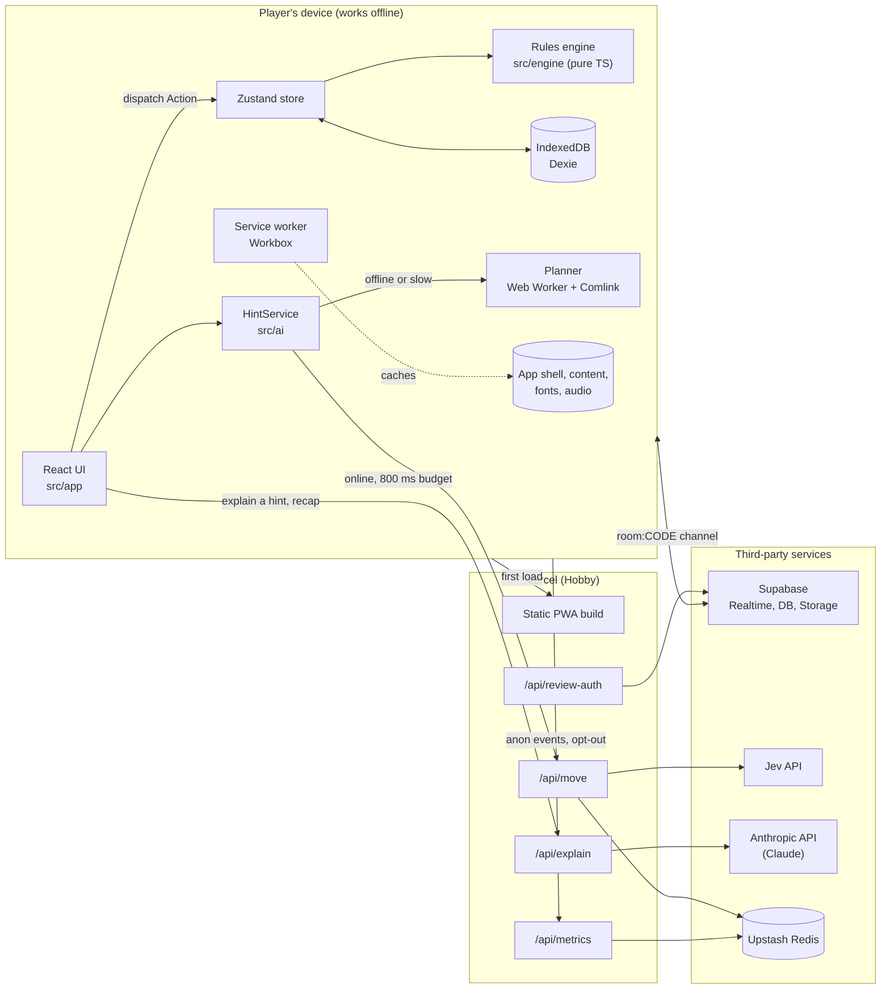

# Tianguis: architecture and dependencies

> **Status: planned.** As of 2026-10-07 the repository holds only planning documents (`README.md`, `north-star.md`, `roadmap.md`, `tasks.md`). Nothing below is built yet. Each section names the task in [tasks.md](../tasks.md) that will build it, so this file can be updated to "built" piece by piece.

## At a glance

| Layer | Choice | Runs where | Task |
|---|---|---|---|
| Language | **TypeScript** (`strict`) everywhere: client, engine, server functions, scripts | Browser, Web Worker, Node | TG-001 |
| Runtime | **Node 22** (pinned in `.nvmrc`) | Local dev, CI, Vercel functions | TG-001 |
| Package manager | **pnpm** | Local, CI | TG-001 |
| UI | **React** + **Vite** single-page app | Browser | TG-001 |
| App shell | **PWA** via `vite-plugin-pwa` (Workbox) | Browser service worker | TG-003 |
| Game rules | Pure TypeScript reducer, no dependencies | Browser, Web Worker, Node (sim, host) | TG-010 to TG-014 |
| Offline storage | **IndexedDB** via Dexie | Browser | TG-018, TG-045, TG-006 |
| Translations | **i18next** + ICU message format | Browser | TG-004 |
| Multiplayer | **Supabase Realtime** (Broadcast + Presence), free tier | Supabase cloud | TG-030 to TG-034 |
| Server | **Vercel functions** under `api/` | Vercel, Hobby plan | TG-002, TG-042, TG-044 |
| Hints and bots (online) | **Jev** `Choice` API, called from `/api/move` | Vercel function | TG-041, TG-042 |
| Hints and bots (offline) | Greedy planner in a Web Worker | Browser | TG-015 |
| Explanations | **Claude** (Anthropic API) as Axo, from `/api/explain` | Vercel function | TG-044 to TG-046 |
| Rate limits, metrics | **Upstash Redis** (Vercel Marketplace, free tier) | Upstash cloud | TG-042, TG-061 |
| Hosting, CI | **Vercel** previews + **GitHub Actions** | Vercel, GitHub | TG-002 |

## System diagram



## Source layout

```
src/engine/   pure game logic: types, rng, reducer, events (never imports React or the browser)
src/app/      React UI: screens, components, Zustand store
src/net/      Supabase room client (create, join, leave, onState, sendIntent)
src/ai/       DecisionProvider, HintService, greedy planner (Web Worker)
src/content/  goods.json, orders.json, events.json, notes.json, credits.json
src/i18n/     catalogs: {es,en,nah,yua,quz}/common.json
api/          Vercel functions: move, explain, metrics, review-auth
scripts/      i18n-check, pull-reviews, jev-smoke, sim
public/audio/ reviewed recordings: {lang}/{goodId}.webm
docs/         this file, balance.md, jev.md, a11y.md, demo.md
```

Path aliases: `@engine`, `@app`, `@net`, `@ai`, `@content` (TG-001).

## Key design decisions

### 1. The engine is a pure, seeded reducer
`apply(state, action) → state` is a pure function, and `legalActions(state, stallId)` enumerates every move. The RNG (mulberry32) keeps its state **inside** `GameState`, so any game replays exactly from its seed and action log. This one decision lets the same code run in four places: the UI store, the bot worker, the Node simulation harness (`pnpm sim`) and the multiplayer host. `src/engine/` may not import React, the DOM or any network code; lint enforces this.

### 2. Offline first, network optional
Everything needed for a solo or pass-and-play game is in the static build and precached by Workbox: app shell, `src/content/**`, self-hosted Noto fonts, and recorded audio (runtime `CacheFirst`). `/api/*` is `NetworkOnly`, and every feature that uses it has an offline fallback:

| Feature | Online | Offline fallback |
|---|---|---|
| Consejo hint | Jev via `/api/move` | Planner in a Web Worker |
| Bot seats | Jev, 600 ms budget | Planner |
| Axo explanation | Claude via `/api/explain` | Cached explanation in IndexedDB, else the bundled cultural note |
| Recap story | Claude, `mode=recap` | Template text |
| Telemetry | Flushed to `/api/metrics` | Queued in IndexedDB |
| Saved game | n/a | Dexie, keyed by `gameId`, versioned schema |

### 3. Multiplayer: the host is the source of truth
Rooms use a Supabase Realtime channel `room:{code}` (5-letter code, no O/0/I/1). There are **no database tables for play**.
- Clients send `intent{action, seatId, nonce}` over Broadcast.
- The host checks the intent against `legalActions` and the turn, applies it, and broadcasts `state{version, state}`. Clients render only the newest version.
- Bot seats run on the host.
- Presence tracks seats. If the host leaves, the seat with the earliest `joinedAt` takes over and rebroadcasts `version + 1` (TG-033).
- Nothing is hidden, since the game is co-operative, so state is never redacted.

### 4. AI is pluggable and always has a fallback
`DecisionProvider { name: 'jev' | 'planner'; pick(state, seat, legal) }` (TG-040). `HintService` tries Jev only when online and within 800 ms, and the UI labels which engine answered. Jev picks an **index into the legal-action list**, so it can never produce an illegal move.

### 5. Claude never writes Indigenous-language text
`/api/explain` speaks only Spanish or English. The system prompt includes the approved glossary as a cached block; the response is structured as `{text, termsUsed[]}`, and the server rejects any term not in the approved glossary and returns template text instead. A refusal or any error also returns template text (TG-044).

### 6. Content is data with a review status
Every Indigenous-language string carries `status: draft | reviewed | approved` and a `source`. The UI shows an "en revisión" badge for anything not approved, and `VITE_HIDE_UNREVIEWED=true` hides languages that aren't fully approved. Reviewer submissions go to Supabase; a script turns approved ones into a PR so a person always merges content (TG-020 to TG-023).

### 7. Secrets stay on the server
Only `VITE_*` variables reach the browser, and the only ones planned are the Supabase URL and anon key (public by design) and the build flag. Jev and Anthropic keys live only in Vercel function env vars. `/api/move` validates input with zod, caps the body at 8 KB and rate-limits per room.

## Dependencies

All versions are to be pinned when TG-001 lands; none are installed yet.

### Runtime (shipped to the browser)

| Package | Purpose | Task |
|---|---|---|
| `react`, `react-dom` | UI | TG-001 |
| `zustand` | Store wrapping the engine; the UI only dispatches `Action`s | TG-016 |
| `i18next`, `react-i18next`, `i18next-icu` | Translations with ICU plurals and placeholders | TG-004 |
| `workbox-window` (via `vite-plugin-pwa`) | Service-worker registration and the "Update available" toast | TG-003 |
| `dexie` | IndexedDB wrapper for saves, the telemetry queue and the explanation cache | TG-018 |
| `comlink` | Calling the planner in a Web Worker | TG-015 |
| `@supabase/supabase-js` | Realtime rooms; reviewer submissions | TG-030, TG-023 |
| `qrcode` | Room QR codes | TG-031 |
| `@fontsource/noto-sans`, `@fontsource/noto-sans-display` | Self-hosted fonts with saltillo, macrons and glottal marks | TG-005 |
| `zod` | Content schemas (shared with the server) | TG-020 |

The engine itself (`src/engine/`) has **zero** dependencies.

### Server (Vercel functions only)

| Package | Purpose | Task |
|---|---|---|
| `@anthropic-ai/sdk` | `/api/explain`: Claude as Axo, streaming, prompt caching, structured output | TG-044 |
| Jev JS SDK (name to be confirmed) | `/api/move`: `Choice` over legal actions | TG-041, TG-042 |
| `@upstash/ratelimit`, `@upstash/redis` | Per-room rate limits; daily metric counters | TG-042, TG-061 |
| `zod` | Request validation | TG-042, TG-044 |

### Development and CI

| Package | Purpose | Task |
|---|---|---|
| `typescript` | `strict` typecheck (`tsc -b`) | TG-001 |
| `vite`, `@vitejs/plugin-react` | Dev server and build | TG-001 |
| `vite-plugin-pwa` | Manifest and Workbox config | TG-003 |
| `eslint`, `typescript-eslint`, `eslint-plugin-react-hooks` | Lint | TG-001 |
| `prettier` | Formatting | TG-001 |
| `vitest`, `jsdom` | Unit tests | TG-001 |
| `fast-check` | Property tests: goods are conserved and never negative | TG-012 |
| `@playwright/test` | End-to-end and smoke tests | TG-001, TG-016 |
| `@axe-core/playwright` | Accessibility checks | TG-005, M5 |
| `tsx` (or similar) | Running `scripts/*.ts` | TG-004, TG-017 |

## External services

| Service | Plan | Used for | Needed for offline play? |
|---|---|---|---|
| **Vercel** | Hobby (free) | Static hosting, preview deploy per PR, `api/*` functions, logs | First load only |
| **GitHub** | Free | Source, Actions CI (`ci.yml` runs `pnpm check` and the Playwright smoke test against the preview URL) | No |
| **Supabase** | Free | Realtime channels for rooms; `review_submissions` table and `audio-pending` Storage bucket for the reviewer tool | No |
| **Anthropic API** | Pay as you go | Axo explanations and recap narration | No |
| **Jev** (typesafe.ai) | Early access, quota to be confirmed in TG-041 | Online hints and bot moves | No |
| **Upstash Redis** | Free, via Vercel Marketplace | Rate limiting, metric aggregation | No |

Free-tier caveats to keep in mind: Vercel Hobby is for non-commercial use, so a paid launch would need Pro; Supabase pauses free projects after a period of inactivity, which would break online rooms until the project is resumed.

## Environment variables

| Variable | Scope | Used by | Required? |
|---|---|---|---|
| `VITE_SUPABASE_URL`, `VITE_SUPABASE_ANON_KEY` | Client (public) | Online rooms, reviewer tool | Only for online rooms |
| `VITE_HIDE_UNREVIEWED` | Client, build time | Language picker | No |
| `JEV_API_KEY` | Server | `/api/move` | No; hints fall back to the planner |
| `ANTHROPIC_API_KEY` | Server | `/api/explain` | No; explanations fall back to note cards |
| `REVIEW_CODE` | Server | `/api/review-auth` | Only for the reviewer tool |
| `UPSTASH_REDIS_REST_URL`, `UPSTASH_REDIS_REST_TOKEN` | Server | Rate limits, metrics | No; set automatically by the Vercel Marketplace integration |

The Upstash pair is not in the README's table yet.

## Commands (planned)

```sh
nvm use          # Node 22
pnpm install
pnpm dev         # Vite dev server
pnpm check       # eslint . && tsc -b && vitest run
pnpm build       # production build
pnpm sim --games 1000 --difficulty normal --players 3   # balancing harness (TG-017)
```

## Open questions

- **Jev SDK:** package name, auth, whether it runs in Vercel's Node runtime, quota and latency. TG-041 answers these in `docs/jev.md`.
- **Reviewer writes to Supabase:** TG-023 saves submissions from the browser. Either the anon key plus row-level security that only allows inserts, or a server function holding a service-role key. Not decided.
- **Metrics storage:** TG-006 says events appear in Vercel logs; TG-061 aggregates them in Upstash. The doc assumes Upstash is the store once TG-061 lands.
- **Licenses:** MIT for code and CC BY-SA for content are planned but not chosen (TG-064).
